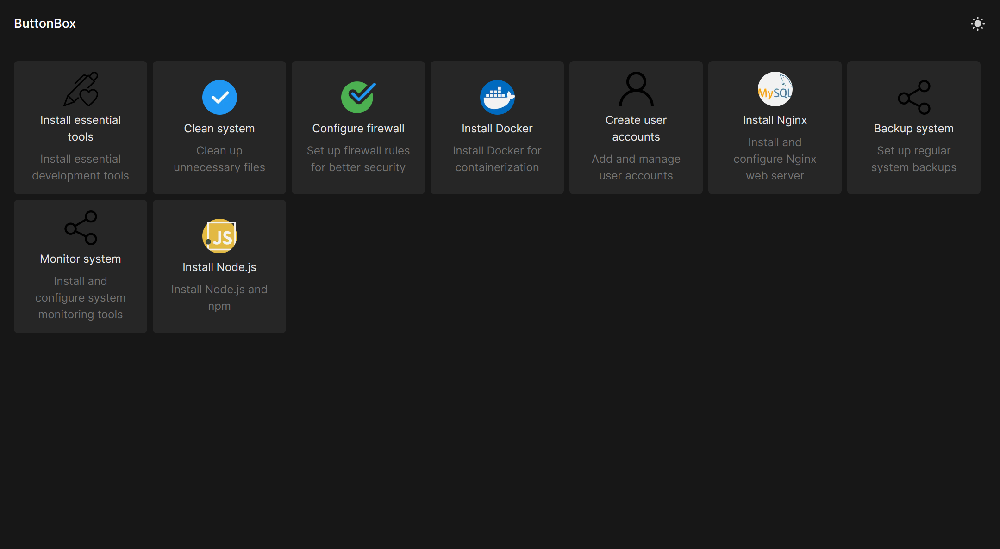

> Hello! I am happily announcing that I will not continue the development of buttonbox, that's because buttonbox was nothing more than a project to test my skills and develop a better theme for olivetin. Since people liked the theme I decided that instead of reinventig the wheel and trying to rewrite the entire olivetin app in next js (which is not possible due to some limitations) I can just write the theme people liked. You can check the "buttonbox" theme [here](https://www.olivetin.app/themes/posts/buttonbox/), hope you like it :)

> If you still want to use buttonbox for some reason you can build the docker image `npm run build:image` and launch the buttonbox container with `npm run start:image`

<div align="center">
  <h1>ButtonBox</h1>
  <p>Run your shell tasks with one click</p>
</div>



This project is inspired from [Olivetin](https://www.olivetin.app/), it is the same app but with a more modern UI (and probably less features lol).

### Installation ⬇️

Right now the installation right now is not that easy but I am working on a solution to install the app easily. For now you need to build the app then run it using node.

Firstly install the requirements:

```bash
npm install
```

Then build the app with this command:

```bash
npm run build
```

Finally run the app:

```bash
npm run start
```

The app should now be listening on `http://localhost:3000`.

### Configuration ✏️

All the buttons are configured with these 4 options:

| Name          | Description                        | Required |
| ------------- | ---------------------------------- | -------- |
| `name`        | The titile of the button.          | yes      |
| `icon`        | The url of the icon to use.        | no       |
| `description` | A small description of the button. | no       |
| `command`     | The command to run.                | yes      |

Here is an example configuration:

```yaml
buttons:
  - name: Hello world!
    description: Echo hello world in the terminal.
    command: echo "Hello, world!"
```

### Contributing ❤️

If you like you want to contribute to the project you can do so by forking the project making your changes and opening a pull request. Any help is appreciated.

### License 📜

The project is licensed under the GPL V3 License. You may modify, distribute and copy the code as long as you keep the changes in the source files. Any modifications you make using a compiler must be also licensed under the GPL license and include build and install instructions.
